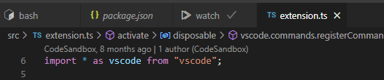

# vscode-ext-quit-text-tabs

VSCode extension to close text tabs.

## Usage

1. The terminal tab and some editor(text) tabs in tab group(editor group).

   

1. Execute the `View: Quit Text Tabs` command from the command palette

1. Editor tabs are closed

   
