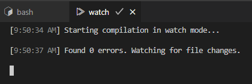

# vscode-ext-quit-text-tabs

VSCode extension to quit(close) text tabs.

## Usage

1. The terminal tab, the task tab and some editor(text) tabs in tab group(editor group).

   

1. Execute the `View: Quit Text Tabs` command from the command palette

1. Editor tabs are closed

   

## Settings

### quitTextTabs.viewtypes

Specify the `viewType` of additional tabs to close.

The default value is set to close the built-in markdown preview.

```json
{
  "quitTextTabs.viewtypes": ["markdown\\.preview$"]
}
```

Please refer to the next section for information about `viewType`.

## Tab Info

The `View: View Active Tab Info` command displays information about the active tab.
(A new text tab is opened and the information is pasted into it)

built-in markdown preview(`viewType` is `mainThreadWebview-markdown.preview`):

```json
{
  "tabType": "webview",
  "info": {
    "isActive": true,
    "label": "Preview test1.md",
    "input": {
      "viewType": "mainThreadWebview-markdown.preview"
    },
    "isDirty": false,
    "isPinned": false,
    "isPreview": false
  }
}
```

Note that the `viewType` is typically set only for tabs of type `webview` or `custom`. This extension also checks the `viewType` only for tabs of type `webview` or `custom`.

terminal(`viewType` is undefined):

```json
{
  "tabType": "terminal",
  "info": {
    "isActive": true,
    "label": "bash",
    "input": {},
    "isDirty": false,
    "isPinned": false,
    "isPreview": false
  }
}
```
